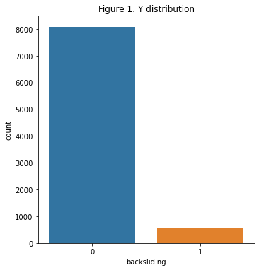
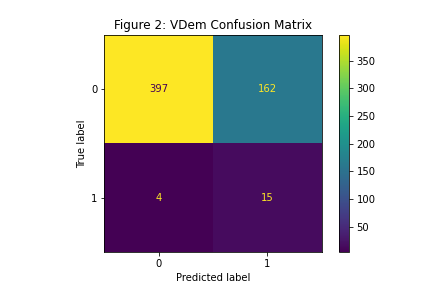
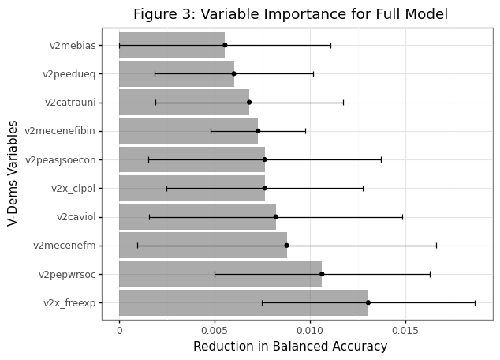
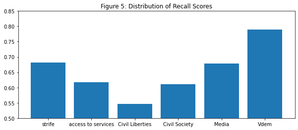

## 1. Introduction

Much has been made recently of the fact that the global trend towards democracy seems to be reversing and that many countries are experiencing what is known as democratic backsliding. Democratic backsliding, defined as the "state-led debilitation or elimination of the political institutions sustaining an existing democracy," is a catch-all term to describe the various processes by which states move towards more authoritarian forms of governance.[^1] In this project, I've attempted to build a machine learning model that can accurately predict democratic backsliding. In the following sections, I will first go through a brief background about the issue and a discussion of the data sources used for this project. I will then explain the steps taken to conduct the analysis. Finally, I will discuss the model's results, what we can infer from them, and how the model can be improved.

## 2. Problem Statement and Background

The phenomenon of democratic backsliding is becoming increasingly common, and the average level of democracy worldwide has slipped to where it was before the year 2000.[^2] In fact, electoral autocracies are now the most common form of government in the world. Over one third of the world's population live in countries that are currently becoming more authoritarian. [^3]  Political scientists have developed a relatively robust understanding of the various processes by which democracies break down, but the question remains, however: what are the causal factors of democratic backsliding and what indicators can be used to predict whether or not a country will regress farther away from democratic governance? 

The methods by which democratic erosions occur have changed over the decades.[^5] Faster more dramatic autocratization events. such as coups, have become much less common. Instead, they have been replaced by a slower, less dramatic but no less nefarious, erosion of democratic principles, freedoms, and competition space. As such, it is especially uncommon to see a full slide to autocracy now. This is perhaps even more dangerous, as slowly chipping away at freedoms is less likely to alarm the domestic international public, allowing for dramatic changes over time with little to no push back. With this in mind, it's also important to note that backsliding doesn't necessarily have to entail a wholesale change from democracy to autocracy. Democracies can remain democratic during and after experiencing the erosion of their institutions, however the quality of democratic governance in these states is both lessened and more susceptible to further erosion. In the same vein, it is also possible for autocracies to experience backsliding, through a further restriction of freedoms and tighter control over political participation.[^6]  

The hope of the project is that if the model can accurate predict these instances, we can then use the model's decision criteria to impute what it is that causes backsliding. In their paper on backsliding, Waldner and Lust present 6 different families of theories that the literature has attempted to use to explain backsliding.[^4] This model addresses two of them- specifically Political Institutions and Social Structures/Political Coalitions. The model controls for country-level economic prosperity and population size, but economic indicators are not the primary focus of the analysis. 

Modeling political instability is difficult for multiple reasons. Two of those reasons we will address in this paper. The first is that democratic backsliding is a relatively rare event. Secondly, existing literature and attempts to to model global instability have shown that the predictive power of models tends to vary substantially based on the time period of interest, and therefore it is important to control for temporal effects.[^7] One can expect this to hold true for democratic backsliding as well. 

## 3. Data

The data used for this project has been pulled from several different sources. The unit of analysis is country-year, with observations beginning in 1960. The model contains data from 166 countries, which were selected because they overlapped between all data sources. All of the data was loaded into pandas dataframes, and all of the manipulations were made within the pandas framework unless otherwise specified.[^8]  Country names appeared differently across the sources, and so were standardized prior to merging using the country-converter package.[^9]

### 3.1 Dependent variable

To measure democratic backsliding, information on the comparative democracy and autocracy levels for each country was pulled from the Polity Project's Polity 5 data set. Measures of democratic backsliding were created by subtracting the year of interest's polity score from the year prior. The Polity 5 data set covers all major states over the period 1800-2018 and measures various qualities of democratic and authoritarian governance for each.[^10]  Most importantly for this project, each regime is given a "Polity Score," on a 21 point scale from -10 (hereditary monarchy) to 10 (consolidated democracy). The dependent variable is a binary variable, with a negative year over year difference in polity score being coded as a 1- representing an incidence of democratic backsliding- and a positive year over year difference or no change was coded as a 0- indicating no evidence of backsliding. The data shows that democratic backsliding is a rare event- as shown in Figure 1, out of the 8,575 country years since 1960 for which Polity Scores were available, there were only 562 incidents of backsliding- just about 6.5%.       

### 3.2 Independent Variables

They key independent variables constitute a set of social and institutional factors and were pulled from the Varieties of Democracy dataset. The V-Dem index is a "multidimensional and disaggregated data set that reflects the complexity of the concept of democracy as a system of rule."[^11] It provides indices for features of democracy at various levels of abstraction. Because the V-Dem data file was too large to upload to github, I first filtered by year, added decades dummy variables to address temporal effects, made the features selection, and then uploaded that as the file vdem_small. 

Of the several hundred possible indicators in the full V-Dem data set, I selected 58 and split them into 5 unique feature buckets. These buckets are: civil liberties, civil society, media freedom, access to services, and strife. Each bucket I tested individually before running a final model including all 58 variables. Some of the missing V-Dem variables were imputed based on the last valid observation for that country, with the assumption that in the vast majority of cases, drastic shifts in any one indicator were not just rare, but almost non-existent. However, missingness tended to be clustered by country, and most countries that had a missing value for an indicator didn't have any indicator at all. Thus the imputation only filled a few gaps. This may bring into question the validity of the prediction made by the full V-Dem model, given that the number of features increased opportunities for missingness, and caused more observations to be dropped. 

The initial intent of the project was to use economic indicators as their own feature bucket. However, during data collection it became clear that the economic indicators being explored had significant missingness, particularly in the period prior to 1990. Due to the fact that democratic backsliding is already a rare event, the missingness proved to be too significant of an issue with too many observations  being dropped. Instead, I chose to modify the model by using yearly GDP per capita growth, along with population, to control for different effects of the V-Dem variables for countries of varying sizes and economic development.

Population Data was sourced from the World Bank and information on GDP and GDP per capita were sourced from Gapminder, which provides a yearly estimate in 2011 dollars, standardized across countries for purchasing power parity.[^12] After 1990, the Gapminder data is also sourced from the World Bank, while in the period beforehand it is based on several other sources, including the Maddison projects historical statistics.[^13] Its pre-1990 estimations are not as accurate as the World Bank data that follows them, however it is far more complete than other available sources and in the interest of maintaining as many observations of backsliding as possible, and because in this analysis economic indicators serve more as a control variable and relative size is more important than the exact number, I felt that this was the best choice. Here it is also important to note that the Gapminder data was pulled from the Gapminder project's website directly, which differs slightly from the data available through the Gapminder python package. 

Two data manipulations were made with respect to time. As mentioned in the background section, previous literature has suggested that there are large temporal effects in prediction models of this type. In order to address the issue of probable temporal variation, I included a dummy variable for each decade. Finally, operating under the assumption that it takes time for conditions to take effect I lagged all the independent variables (with the exception of decades). I attempted three different time lags- 1 year, 2 years, and 5 years. 

## 4. Analysis

The machine learning portion of this project relied heavily on Python's Scikit-learn package, which provides a suite of tools for predictive data analysis.[^14] In order to build the most robust and accurate model possible, I ran each feature bucket through a machine learning pipeline. The pipeline helps to automate the machine learning workflow, by running each bucket through a variety of different classifiers with their own unique tuning parameters, cross validating the results, and selecting the model with the best fit. Cross validation allows us to estimate the best model before running the test data through it by "holding out" a subset of the training observations and then using them as a stand-in to test. The Cross-Validation method used here is k-Fold validation, which splits the observations into k groups, treating only the test set as the test set. This is then repeated k times, with the cross validation estimate computed based on the average of the k test groups. For the purposes of this analysis, k was set to 5.   

As mentioned earlier, one of the chief difficulties with predicting democratic backsliding is that it is a relatively rare event, and so the data set is imbalanced. Imbalanced classification problems present a unique challenge, in that there are too few examples of the minority class for the model to effectively learn the decision boundary, which in turn causes the model to over predict the majority class. One way to address this is too use various resampling techniques in order to artificially increase the size of the minority class. The technique used in this model is known as up-sampling or overampling. Oversampling sampling allows for an artificial increase in the number minority examples by generating new samples from your existing data to address the balancing issue. In order to implement oversampling I used the RandomOverSampler feature through the sklearn contributor package, imblearn, which is designed specifically to assist in handling imbalanced data sets.[^15] The RandomOverSampler was included as part of the pipeline.  

Finally, all visualizations in this report were created using plotnine, matplotlib and the seaborn library, or the plotting functions embedded within SKLearn.[^16] [^17]

### 4.1 Classifiers

The first classifier in the pipeline is a Naive Bayes. A naive bayes classifier is a probabilistic classifier based on the Bayes theorem. Put simply, it calculates the probability that there is backsliding, given the values of the independent variables, assuming that the independent variables are also independent from one another. This is a simpler model and had no tuning parameters.

The second classifier is K Nearest Neighbors. The K Nearest Neighbors classifier works by identify the number of 'K' points from the training data that are closest to our observation of interest, and then determines its category based on the majority category of the nearest points. This model was tuned on the number of neighbors it uses for its calculation.

The third classifier is a Decision Tree. A decision tree classifies observations by splitting them based upon specific decision criteria (eg countries with GDPs > x). It then predicts that each observation belongs to the most commonly occurring class of training observations in the region to which it belongs. This model was tuned on the tree's max depth. Related to the decision tree is the fourth classifier, a Random Forest. Random forests are similar to a decision tree but with an important tweak. A Random Forest model builds several different trees by pulling several training sets from the training data along with a random number of predictors. It then creates its decision criteria by averaging across the predictions from each tree. It was tuned on the maximum depth of each tree, the number of trees to build, and maximum number of features to consider for each tree.

The fifth and final classifier is a Support Vector Machine. Support Vector Machines make classifications by creating "decision boundaries" which make the distinction between two or more classes. This is tuned on a C parameter- the classifiers willingness to accept errors in training the classifier in order to prevent overfitting, and a kernel parameter, which controls what function is used to draw the boundaries.

### 4.2 Metrics

I used two metrics in order to evaluate the performance of the model. The primary metric, and the one used by the pipeline to determine the relative predictive power of each model, was balanced accuracy. Balanced accuracy is superior to regular accuracy metrics when dealing with imbalanced data because it weights the accuracies according to the inverse prevalence of their class, preventing inflated estimates due to simply predicting the dominant class. I also tested the recall power of the best model as determined by the pipeline. Recall is calculated as tp / (tp + fn) - or the ability of the classifier to find all the positive samples. In this case this is equivalent to being able to correctly identify backsliding events.

### 4.3 Variable Importance

After running and tuning the models for each bucket and then running the full model, I attempted to ascertain the importance of each variable in the model. To do so I used SkLearn's permutation function. This scrambles the data one variable at a time and then uses the model to re-predict on the now scrambled data. We can then determine what variables are most important to the model based on the largest changes in the model's predictive accuracy, determined again by its balanced accuracy score. This permuation was only run on the full model.

## 5. Results

I found that lagging  the independent variables by 5 years produced the best models across the board and improved the score of the full model dramatically, raising the balanced accuracy score from just over .65 to nearly 0.75. This suggests that backsliding events are slow to occur, and are often in response to long-standing issues. However the model is relatively unpredictive. Furthermore, the recall score is discouraging, with the model only being able to correctly identify about 79% of backsliding events. The confusion matrix in Figure 2 shows how the full model did in assigning the test data to its correct class.

Based on the permutations run to assess variable importance, the most important variable in the full model was Freedom of Expression, with an average impact on the Balanced Accuracy score of .013. The top 10 most important variables are represented in Figure 3 (variable names are coded in the same format as they are in the V-Dem Dataset). Interestingly, the top 10 are distributed across all of the feature buckets, implying that there isn't any specific defining set of characteristics that is instrumental in predicting backsliding. Rather there are many dispersed causal factors. 

The Support Vector Machine was the classifier with the most success, producing the best models for all buckets except Civil Liberties- which performed the best using a Random Forest model)- and the full model that contained all 58 features- with k Nearest Neighbors being the most successful classifier in this case. The success of KNN for the full model may be due to the fact that the observations were more limited than in the other model, given the missingness issue discussed above.

In terms of performance metrics, the average balanced accuracy score is 0.679 indicating that, accounting for class weights, across all feature buckets the model had only about 68% accuracy. The score for the full model was better, at 0.7498, meaning it is accurate roughly 75% of the time. The distribution of balanced accuracy scores is shown in Figure 4. The average recall score is 0.658 indicating that, across the various buckets, the model was able to correctly identify backsliding events about 66% of the time. Again, the recall score for the full model was substantially better, at 0.789. The distribution of recall scores can be seen in Figure 5. 

<table style="height:10p"><tr><td></td><td></td></tr></table>

## 6. Discussion and Future Research

Of the 3 tasks that I set out for myself I was able to complete 2 of them successfully and one of them with a minimal amount of success. I was able to successfully collect and combine my data sources into one single DataFrame, and to perform all of the necessary data wrangling and transformations to make it usable for this analysis. I was also able to create visualizations to represent the distribution of my data and the results of the model. While I was able to build a machine learning model, it was not as predictive as I had hoped. I do, however, think that this is a good start and that there is potential to improve upon the model in the future.  

Given more time or in future iterations of the project, there are some changes and additional analyses that I would like to make. This analysis focuses solely on events within a country. However no country exists in a vacuum. Future iterations of this project should include variables for events in neighboring countries. Additionally, I would like to try different sampling techniques, such as SMOTE sampling. Lastly, I would like to build upon the model so that it includes country-foxed effects. While building the model I had attempted to implement these effects but the addition of 166 extra dummy variables for each bucket made the model freeze. 

## Works Cited
&nbsp;&nbsp;&nbsp;&nbsp;&nbsp;&nbsp;Beger, Andreas, Morgan, Richard K., and Maxwell, Laura, 2020, “The Democratic Spaces Barometer: global forecasts of autocratization and democratization”, https://www.v-dem.net/en/analysis/DemSpace/

&nbsp;&nbsp;&nbsp;&nbsp;&nbsp;&nbsp;Bermeo, Nancy. "On Democratic Backsliding." Journal of Democracy 27, no. 1 (2016): 5-19. doi:10.1353/jod.2016.0012.

&nbsp;&nbsp;&nbsp;&nbsp;&nbsp;&nbsp;Bowlsby, D., Chenoweth, E., Hendrix, C., & Moyer, J. (2020). The Future is a Moving Target: Predicting Political Instability. British Journal of Political Science, 50(4), 1405-1417. doi:10.1017/S0007123418000443
    
&nbsp;&nbsp;&nbsp;&nbsp;&nbsp;&nbsp;Coppedge, Michael, John Gerring, Carl Henrik Knutsen, Staffan I. Lindberg, Jan Teorell, David Altman, Michael Bernhard, M. Steven Fish, Adam Glynn, Allen Hicken, Anna L¨uhrmann, Kyle L. Marquardt, Kelly McMann, Pamela Paxton, Daniel Pemstein, Brigitte Seim, Rachel Sigman, Svend-Erik Skaaning, Jeffrey Staton, Steven Wilson, Agnes Cornell, Nazifa Alizada, Lisa Gastaldi, Haakon Gjerløw, Garry Hindle, Nina Ilchenko, Laura Maxwell, Valeriya Mechkova,
   
&nbsp;&nbsp;&nbsp;&nbsp;&nbsp;&nbsp;Kibirige, Hassan, et. al (2020, August 5). has2k1/plotnine: v0.7.1 (Version v0.7.1). Zenodo. http://doi.org/10.5281/zenodo.3973626
   
&nbsp;&nbsp;&nbsp;&nbsp;&nbsp;&nbsp;Lührman, Anna, Seraphine F. Maerz, Sandra Grahn, Nazifa Alizada, Lisa Gastaldi, Sebastian Hellmeier, Garry Hindle and Staffan I. Lindberg. 2020. Autocratization Surges – Resistance Grows. Democracy Report 2020. Varieties of Democracy Institute (V-Dem).
   
&nbsp;&nbsp;&nbsp;&nbsp;&nbsp;&nbsp;Marshall, Monty G., Ted Robert Gurr. 2020. "Polity5: Political Regime Characteristics and Transitions, 1800-2018. Dataset Users' Manual. Center for Systemic Peace. http://www.systemicpeace.org/inscr/p5manualv2018.pdf"
    
&nbsp;&nbsp;&nbsp;&nbsp;&nbsp;&nbsp;Mechkova, Valeriya, Anna Lührmann, and Staffan I. Lindberg. "How Much Democratic Backsliding?" Journal of Democracy 28, no. 4 (2017): 162-169. doi:10.1353/jod.2017.0075.

&nbsp;&nbsp;&nbsp;&nbsp;&nbsp;&nbsp;Lemaitre, Guillaume, Nogueira, Fernando, & Aridas, Christos K. (2017). Imbalanced-learn: A Python Toolbox to Tackle the Curse of Imbalanced Datasets in Machine LearningJournal of Machine Learning Research, 18(17), 1-5.

&nbsp;&nbsp;&nbsp;&nbsp;&nbsp;&nbsp;Marshall, Monty G., Ted Robert Gurr. 2020. "Polity5: Political Regime Characteristics and Transitions, 1800-2018. Dataset Users' Manual. Center for Systemic Peace. http://www.systemicpeace.org/inscr/p5manualv2018.pdf"

&nbsp;&nbsp;&nbsp;&nbsp;&nbsp;&nbsp;McKinney, W., et al (2010). Data structures for statistical computing in python. In Proceedings of the 9th Python in Science Conference (Vol. 445, pp. 51–56)

&nbsp;&nbsp;&nbsp;&nbsp;&nbsp;&nbsp;Pedregosa, F., et al. (2011). Scikit-learn: Machine Learning in Pytho nJournal of Machine Learning Research, 12, 2825–2830.

&nbsp;&nbsp;&nbsp;&nbsp;&nbsp;&nbsp;Stadler, K. (2017). The country converter coco - a Python package for converting country names between different classification schemes. The Journal of Open Source Software. doi: 10.21105/joss.00332

&nbsp;&nbsp;&nbsp;&nbsp;&nbsp;&nbsp;The World Bank, World Development Indicators (2012). Population, total [Data file]. Retrieved from https://data.worldbank.org/indicator/SP.POP.TOTL

&nbsp;&nbsp;&nbsp;&nbsp;&nbsp;&nbsp;Waksom, Michael, et al. (2020, September 8). mwaskom/seaborn: v0.11.0 (Sepetmber 2020) (Version v0.11.0). Zenodo. http://doi.org/10.5281/zenodo.4019146

&nbsp;&nbsp;&nbsp;&nbsp;&nbsp;&nbsp;Waldner, David & Lust, Ellen. (2018). "Unwelcome Change: Coming to Terms with Democratic Backsliding". Annual Review of Political Science. 21. 10.1146/annurev-polisci-050517-114628. 

[^1]: Nancy Bermeo. "On Democratic Backsliding." Journal of Democracy 27, no. 1 (2016): 5-19. doi:10.1353/jod.2016.0012.
[^2]: Valeriya Mechkova, Anna Lührmann, and Staffan I. Lindberg. "How Much Democratic Backsliding?" Journal of Democracy 28, no. 4 (2017): 162-169. doi:10.1353/jod.2017.0075.
[^3]: Anna Lührmann et al. Autocratization Surges – Resistance Grows. Democracy Report 2020. Varieties of Democracy Institute (V-Dem).https://www.v-dem.net/media/filer_public/de/39/de39af54-0bc5-4421-89ae-fb20dcc53dba/democracy_report.pdf 
[^4]: David Waldner & Ellen Lust. (2018). "Unwelcome Change: Coming to Terms with Democratic Backsliding". Annual Review of Political Science. 21. 10.1146/annurev-polisci-050517-114628. 
[^5]: Andreas Beger, Richard K. Morgan, and Laura Maxwell, 2020, “The Democratic Spaces Barometer: global forecasts of autocratization and democratization”, https://www.v-dem.net/en/analysis/DemSpace/
[^6]: David Waldner & Ellen Lust. (2018).
[^7]: Drew Bowlsby, Erica Chenoweth, Cullen Hendriz, & Jonathan D. Moyer. (2020). "The Future is a Moving Target: Predicting Political Instability". British Journal of Political Science, 50(4), 1405-1417. doi:10.1017/S0007123418000443
[^8]: W. McKinney, et al (2010). Data structures for statistical computing in python. In Proceedings of the 9th Python in Science Conference (Vol. 445, pp. 51–56).
[^9]: K. Stadler, (2017). The country converter coco - a Python package for converting country names between different classification schemes. The Journal of Open Source Software. doi: 10.21105/joss.00332
[^10]: Monty G. Marshall, Ted Robert Gurr. 2020. "Polity5: Political Regime Characteristics and Transitions, 1800-2018. Dataset Users' Manual. Center for Systemic Peace. http://www.systemicpeace.org/inscr/p5manualv2018.pdf"
[^11]: Michael Coppedge et al., 2020. ”V-Dem [Country–Year/Country–Date] Dataset v10” Varieties of Democracy (V-Dem) Project. https://doi.org/10.23696/vdemds20.
[^12]: The World Bank, World Development Indicators (2012). Population, total [Data file]. Retrieved from https://data.worldbank.org/indicator/SP.POP.TOTL
[^13]: Based on free material from GAPMINDER.ORG, CC-BY LICENSE, https://www.gapminder.org/data/documentation/gd001/ 
[^14]: Pedregosa, F., et al. (2011). Scikit-learn: Machine Learning in Pytho nJournal of Machine Learning Research, 12, 2825–2830.
[^15]: Guillaume Lemaitre, Fernando Nogueira, & Christos K. Aridas (2017). Imbalanced-learn: A Python Toolbox to Tackle the Curse of Imbalanced Datasets in Machine LearningJournal of Machine Learning Research, 18(17), 1-5.
[^16]: Hassan Kibirige, et. al (2020, August 5). has2k1/plotnine: v0.7.1 (Version v0.7.1). Zenodo. http://doi.org/10.5281/zenodo.3973626
[^17]: Michael Waskom, et al. (2020, September 8). mwaskom/seaborn: v0.11.0 (Sepetmber 2020) (Version v0.11.0). Zenodo. http://doi.org/10.5281/zenodo.4019146
